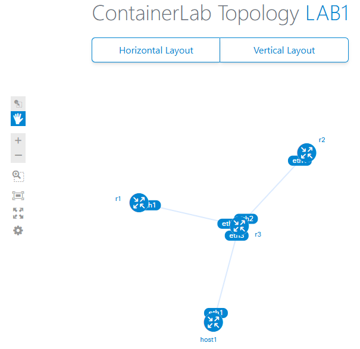
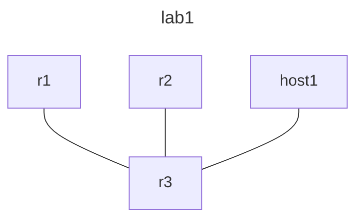

[Containerlab](https://containerlab.dev/install/#sudo-less-operation) is a tool I found very usefull when doing networking labs. I used in the past GNS3 or EVE-NG but I like the aproach to do Lab as a code.

I wll be using this tool to create the labs for the different topics in this site.

## My Setup

I decided to use the miniPC [HCAR5000-MI](https://browser.geekbench.com/v6/compute/compare/1086854?baseline=1086854) and installed Ubuntu 22.04.5 LTS.


## Kinds I will use

Kinds are the different types of devices (vendors/OSs) that you can use in your labs. I will focus on the follwoing but I will be deciding which ones to use based on the protocol to test or de use case:
- [Linux container](https://containerlab.dev/manual/kinds/linux/)
- [MikroTik RouterOS Cloud-hosted router](https://containerlab.dev/manual/kinds/vr-ros/)
- [Arista cEOS](https://containerlab.dev/manual/kinds/ceos/)
- [Cisco XRv9k](https://containerlab.dev/manual/kinds/vr-xrv9k/)


## Containerlab Version

At the moment of writing this doc the following is the version I will use
```bash
richo@richo-HCAR5000-MI:~$ containerlab version
  ____ ___  _   _ _____  _    ___ _   _ _____ ____  _       _
 / ___/ _ \| \ | |_   _|/ \  |_ _| \ | | ____|  _ \| | __ _| |__
| |  | | | |  \| | | | / _ \  | ||  \| |  _| | |_) | |/ _` | '_ \
| |__| |_| | |\  | | |/ ___ \ | || |\  | |___|  _ <| | (_| | |_) |
 \____\___/|_| \_| |_/_/   \_\___|_| \_|_____|_| \_\_|\__,_|_.__/

    version: 0.67.0
     commit: 77fe6c88
       date: 2025-04-01T09:21:06Z
     source: https://github.com/srl-labs/containerlab
 rel. notes: https://containerlab.dev/rn/0.67/
 ```
 If there is a feature that requires a newer version, I will update the version in the lab.

## Create containers

For each `Kind` you need to follow the instruction to get the container created. The following will be the result once you have the containers ready to be used.
```bash
richo@richo-HCAR5000-MI:~$ sudo docker images
REPOSITORY             TAG        IMAGE ID       CREATED        SIZE
vrnetlab/vr-xrv9k      7.9.2      f82dfb9b9473   7 months ago   2.12GB
vrnetlab/vr-routeros   7.15.3     21389b541d49   7 months ago   459MB
vrnetlab/vr-routeros   6.49.13    0183779c3ed0   7 months ago   454MB
ceos                   4.32.2F    64bb42a49ac6   7 months ago   2.45GB
alpine                 latest     91ef0af61f39   7 months ago   7.8MB
```

## Create the lab
We will use yaml files to define the lab icluding the links and startup configurations.

The following is a example based on the devices we said will be used in this site
```yaml
name: lab1
mgmt:
  network: mgmt
  ipv4-subnet: 172.100.100.0/24
  ipv6-subnet: 2001:172:100:100::/80
topology:
  nodes:
    r1:
      kind: ceos
      image: ceos:4.32.2F
      mgmt-ipv4: 172.100.100.2
    r2:
      kind: cisco_xrv9k
      image: vrnetlab/vr-xrv9k:7.9.2
      mgmt-ipv4: 172.100.100.3
    r3:
      kind: mikrotik_ros
      image: vrnetlab/vr-routeros:6.49.13
      mgmt-ipv4: 172.100.100.4
    host1:
      kind: linux
      image: alpine:latest
      mgmt-ipv4: 172.100.100.5
  links:
    - endpoints: ["r1:eth1", "r3:eth1"]
    - endpoints: ["r2:eth1", "r3:eth2"]
    - endpoints: ["host1:eth1", "r3:eth3"]
```
And with ther following command we will deploy the lab (or simplified `clab -t lab1 dep -c`)
```bash
richo@richo-HCAR5000-MI:~/topos$ containerlab --topo lab1 deploy --reconfigure
15:53:34 INFO Containerlab started version=0.67.0
15:53:34 INFO Parsing & checking topology file=lab1
15:53:34 INFO Removing directory path=/home/richo/topos/clab-lab1
15:53:34 INFO Creating docker network name=mgmt IPv4 subnet=172.100.100.0/24 IPv6 subnet=2001:172:100:100::/80 MTU=0
15:53:35 INFO Creating lab directory path=/home/richo/topos/clab-lab1
15:53:35 INFO Creating container name=r3
15:53:35 INFO Creating container name=r1
15:53:35 INFO Creating container name=host1
15:53:35 INFO Creating container name=r2
15:53:35 INFO Running postdeploy actions for Arista cEOS 'r1' node
15:53:35 INFO Created link: r1:eth1 ▪┄┄▪ r3:eth1
15:53:35 INFO Created link: r2:eth1 ▪┄┄▪ r3:eth2
15:53:35 INFO Created link: host1:eth1 ▪┄┄▪ r3:eth3
15:53:56 INFO Adding host entries path=/etc/hosts
15:53:56 INFO Adding SSH config for nodes path=/etc/ssh/ssh_config.d/clab-lab1.conf
╭─────────────────┬──────────────────────────────┬─────────┬─────────────────────╮
│       Name      │          Kind/Image          │  State  │    IPv4/6 Address   │
├─────────────────┼──────────────────────────────┼─────────┼─────────────────────┤
│ clab-lab1-host1 │ linux                        │ running │ 172.100.100.5       │
│                 │ alpine:latest                │         │ 2001:172:100:100::4 │
├─────────────────┼──────────────────────────────┼─────────┼─────────────────────┤
│ clab-lab1-r1    │ ceos                         │ running │ 172.100.100.2       │
│                 │ ceos:4.32.2F                 │         │ 2001:172:100:100::3 │
├─────────────────┼──────────────────────────────┼─────────┼─────────────────────┤
│ clab-lab1-r2    │ cisco_xrv9k                  │ running │ 172.100.100.3       │
│                 │ vrnetlab/vr-xrv9k:7.9.2      │         │ 2001:172:100:100::2 │
├─────────────────┼──────────────────────────────┼─────────┼─────────────────────┤
│ clab-lab1-r3    │ mikrotik_ros                 │ running │ 172.100.100.4       │
│                 │ vrnetlab/vr-routeros:6.49.13 │         │ 2001:172:100:100::5 │
╰─────────────────┴──────────────────────────────┴─────────┴─────────────────────╯
```
:::note
Once deployed we get the IP to manage the devices and do SSH or any other management protocol.
:::
:::caution
For default user and password use the one documented on the `Kind` from Containerlab documentation
:::
## Retrieve device/containers information
```bash
richo@richo-HCAR5000-MI:~/topos$ clab ins --name lab1
╭─────────────────┬──────────────────────────────┬─────────┬─────────────────────╮
│       Name      │          Kind/Image          │  State  │    IPv4/6 Address   │
├─────────────────┼──────────────────────────────┼─────────┼─────────────────────┤
│ clab-lab1-host1 │ linux                        │ running │ 172.100.100.5       │
│                 │ alpine:latest                │         │ 2001:172:100:100::3 │
├─────────────────┼──────────────────────────────┼─────────┼─────────────────────┤
│ clab-lab1-r1    │ ceos                         │ running │ 172.100.100.2       │
│                 │ ceos:4.32.2F                 │         │ 2001:172:100:100::2 │
├─────────────────┼──────────────────────────────┼─────────┼─────────────────────┤
│ clab-lab1-r2    │ cisco_xrv9k                  │ running │ 172.100.100.3       │
│                 │ vrnetlab/vr-xrv9k:7.9.2      │         │ 2001:172:100:100::4 │
├─────────────────┼──────────────────────────────┼─────────┼─────────────────────┤
│ clab-lab1-r3    │ mikrotik_ros                 │ running │ 172.100.100.4       │
│                 │ vrnetlab/vr-routeros:6.49.13 │         │ 2001:172:100:100::5 │
╰─────────────────┴──────────────────────────────┴─────────┴─────────────────────╯
```

## Retrieve interfaces information
The following command will show the interfaces of the container `clab-lab1-r3` (the Mikrotik router) but from the perspective of the Linux host
```bash
richo@richo-HCAR5000-MI:~/topos$ clab inspect --name lab1 interfaces -n clab-lab1-r3
╭────────────────┬─────────┬───────┬───────────────────┬───────┬───────┬────────┬─────────╮
│ Container Name │   Name  │ Alias │        MAC        │ Index │   MTU │  Type  │  State  │
├────────────────┼─────────┼───────┼───────────────────┼───────┼───────┼────────┼─────────┤
│ clab-lab1-r3   │ br-mgmt │ N/A   │ fe:02:1a:a4:4a:fa │     2 │  1500 │ bridge │ up      │
│                ├─────────┼───────┼───────────────────┼───────┼───────┼────────┼─────────┤
│                │ eth0    │ N/A   │ 02:42:ac:64:64:04 │   346 │  1500 │ veth   │ up      │
│                ├─────────┼───────┼───────────────────┼───────┼───────┼────────┼─────────┤
│                │ eth1    │ N/A   │ aa:c1:ab:26:d1:59 │   348 │  9500 │ veth   │ up      │
│                ├─────────┼───────┼───────────────────┼───────┼───────┼────────┼─────────┤
│                │ eth2    │ N/A   │ aa:c1:ab:f3:24:27 │   350 │  9500 │ veth   │ up      │
│                ├─────────┼───────┼───────────────────┼───────┼───────┼────────┼─────────┤
│                │ eth3    │ N/A   │ aa:c1:ab:c0:8c:7d │   352 │  9500 │ veth   │ up      │
│                ├─────────┼───────┼───────────────────┼───────┼───────┼────────┼─────────┤
│                │ lo      │ N/A   │                   │     1 │ 65536 │ device │ unknown │
│                ├─────────┼───────┼───────────────────┼───────┼───────┼────────┼─────────┤
│                │ tap0    │ N/A   │ fe:02:1a:a4:4a:fa │     3 │  1500 │ tuntap │ unknown │
│                ├─────────┼───────┼───────────────────┼───────┼───────┼────────┼─────────┤
│                │ tap1    │ N/A   │ 3e:f6:c6:68:97:ec │     4 │ 65000 │ tuntap │ unknown │
│                ├─────────┼───────┼───────────────────┼───────┼───────┼────────┼─────────┤
│                │ tap2    │ N/A   │ 72:15:a3:15:71:48 │     5 │ 65000 │ tuntap │ unknown │
│                ├─────────┼───────┼───────────────────┼───────┼───────┼────────┼─────────┤
│                │ tap3    │ N/A   │ a2:52:60:4a:33:1e │     6 │ 65000 │ tuntap │ unknown │
╰────────────────┴─────────┴───────┴───────────────────┴───────┴───────┴────────┴─────────╯
```

## Login to a container
With the following command you can login to the container.
```bash
richo@richo-HCAR5000-MI:~/topos$ sudo docker exec -it clab-lab1-r1 bash
bash-5.1# ip add show | grep 172.100.100
    inet 172.100.100.2/24 brd 255.255.255.255 scope global eth0
    inet6 2001:172:100:100::3/80 scope global
bash-5.1#
```
:::note
The container is a linux container so you can use the same commands as in a linux machine.
:::

## See the diagram of the lab
### Web
We can use the following command to start a web server and then open it in a browser with the URL `http://<your server ip>:50080`
```bash
richo@richo-HCAR5000-MI:~/topos$ clab -t lab1 graph
15:40:48 INFO Parsing & checking topology file=lab1
15:40:48 INFO Serving topology graph on http://0.0.0.0:50080
```
The result of that after opening the URL in a browser is the following:

### Mermaid
Another option is to generate a mermaid file and then use a tootl to render it. In this case this site is aware of mermaid code so the following is an example of the code that will be generated.
```bash
richo@richo-HCAR5000-MI:~/topos$ clab -t lab1 graph --mermaid
16:15:25 INFO Parsing & checking topology file=lab1
16:15:25 INFO Created mermaid diagram file: /home/richo/topos/clab-lab1/graph/lab1.mermaid
```
```bash
richo@richo-HCAR5000-MI:~/topos$ cat  /home/richo/topos/clab-lab1/graph/lab1.mermaid
---
title: lab1
---
graph TD
  r1---r3
  r2---r3
  host1---r3
```
And the following is the rendered result


## Capture packets
The docuementation of containerlab has a good example of how to capture packets in [this](https://containerlab.dev/manual/wireshark/) section.

I see that the following way is a good way to start:
```bash title="Capture packets with tcpdump"
richo@richo-HCAR5000-MI:~/topos$ sudo ip netns exec clab-lab1-r3 tcpdump -n -i eth0 icmp -c 4
tcpdump: verbose output suppressed, use -v[v]... for full protocol decode
listening on eth0, link-type EN10MB (Ethernet), snapshot length 262144 bytes
17:11:36.240819 IP 172.100.100.1 > 172.100.100.4: ICMP echo request, id 4, seq 448, length 64
17:11:36.240844 IP 172.100.100.4 > 172.100.100.1: ICMP echo reply, id 4, seq 448, length 64
17:11:37.265161 IP 172.100.100.1 > 172.100.100.4: ICMP echo request, id 4, seq 449, length 64
17:11:37.265179 IP 172.100.100.4 > 172.100.100.1: ICMP echo reply, id 4, seq 449, length 64
4 packets captured
4 packets received by filter
0 packets dropped by kernel
```
:::caution
When I did this test the matches where not shown in real time, this might be a issue with my host, tcpdump or the containerlab version.
:::

```bash title="Capture packets with tshark"
richo@richo-HCAR5000-MI:~/topos$ sudo ip netns exec clab-lab1-r3 tshark -i eth0 -c 2
Running as user "root" and group "root". This could be dangerous.
Capturing on 'eth0'
 ** (tshark:8659) 12:27:26.830199 [Main MESSAGE] -- Capture started.
 ** (tshark:8659) 12:27:26.830270 [Main MESSAGE] -- File: "/tmp/wireshark_eth0KGWB52.pcapng"
    1 0.000000000 172.100.100.1 → 172.100.100.4 ICMP 98 Echo (ping) request  id=0x0004, seq=2638/19978, ttl=64
    2 0.000017144 172.100.100.4 → 172.100.100.1 ICMP 98 Echo (ping) reply    id=0x0004, seq=2638/19978, ttl=64 (request in 1)
2 packets captured
```
<details>
<summary>Wireshark like capture with tshark</summary>
```bash
richo@richo-HCAR5000-MI:~/topos$ sudo ip netns exec clab-lab1-r3 tshark -i eth0 -c 2 -V
Running as user "root" and group "root". This could be dangerous.
Capturing on 'eth0'
 ** (tshark:8954) 12:28:51.096198 [Main MESSAGE] -- Capture started.
 ** (tshark:8954) 12:28:51.096253 [Main MESSAGE] -- File: "/tmp/wireshark_eth0FVOF52.pcapng"
Frame 1: 98 bytes on wire (784 bits), 98 bytes captured (784 bits) on interface eth0, id 0
    Interface id: 0 (eth0)
        Interface name: eth0
    Encapsulation type: Ethernet (1)
    Arrival Time: Apr 23, 2025 12:28:51.184826331 PDT
    [Time shift for this packet: 0.000000000 seconds]
    Epoch Time: 1745436531.184826331 seconds
    [Time delta from previous captured frame: 0.000000000 seconds]
    [Time delta from previous displayed frame: 0.000000000 seconds]
    [Time since reference or first frame: 0.000000000 seconds]
    Frame Number: 1
    Frame Length: 98 bytes (784 bits)
    Capture Length: 98 bytes (784 bits)
    [Frame is marked: False]
    [Frame is ignored: False]
    [Protocols in frame: eth:ethertype:ip:icmp:data]
Ethernet II, Src: 02:42:3b:04:4e:73 (02:42:3b:04:4e:73), Dst: 02:42:ac:64:64:04 (02:42:ac:64:64:04)
    Destination: 02:42:ac:64:64:04 (02:42:ac:64:64:04)
        Address: 02:42:ac:64:64:04 (02:42:ac:64:64:04)
        .... ..1. .... .... .... .... = LG bit: Locally administered address (this is NOT the factory default)
        .... ...0 .... .... .... .... = IG bit: Individual address (unicast)
    Source: 02:42:3b:04:4e:73 (02:42:3b:04:4e:73)
        Address: 02:42:3b:04:4e:73 (02:42:3b:04:4e:73)
        .... ..1. .... .... .... .... = LG bit: Locally administered address (this is NOT the factory default)
        .... ...0 .... .... .... .... = IG bit: Individual address (unicast)
    Type: IPv4 (0x0800)
Internet Protocol Version 4, Src: 172.100.100.1, Dst: 172.100.100.4
    0100 .... = Version: 4
    .... 0101 = Header Length: 20 bytes (5)
    Differentiated Services Field: 0x00 (DSCP: CS0, ECN: Not-ECT)
        0000 00.. = Differentiated Services Codepoint: Default (0)
        .... ..00 = Explicit Congestion Notification: Not ECN-Capable Transport (0)
    Total Length: 84
    Identification: 0xfbd1 (64465)
    Flags: 0x40, Don't fragment
        0... .... = Reserved bit: Not set
        .1.. .... = Don't fragment: Set
        ..0. .... = More fragments: Not set
    ...0 0000 0000 0000 = Fragment Offset: 0
    Time to Live: 64
    Protocol: ICMP (1)
    Header Checksum: 0x1e09 [validation disabled]
    [Header checksum status: Unverified]
    Source Address: 172.100.100.1
    Destination Address: 172.100.100.4
Internet Control Message Protocol
    Type: 8 (Echo (ping) request)
    Code: 0
    Checksum: 0xd40f [correct]
    [Checksum Status: Good]
    Identifier (BE): 4 (0x0004)
    Identifier (LE): 1024 (0x0400)
    Sequence Number (BE): 2720 (0x0aa0)
    Sequence Number (LE): 40970 (0xa00a)
    Timestamp from icmp data: Apr 23, 2025 12:28:51.000000000 PDT
    [Timestamp from icmp data (relative): 0.184826331 seconds]
    Data (48 bytes)

0000  db d1 02 00 00 00 00 00 10 11 12 13 14 15 16 17   ................
0010  18 19 1a 1b 1c 1d 1e 1f 20 21 22 23 24 25 26 27   ........ !"#$%&'
0020  28 29 2a 2b 2c 2d 2e 2f 30 31 32 33 34 35 36 37   ()*+,-./01234567
        Data: dbd1020000000000101112131415161718191a1b1c1d1e1f202122232425262728292a2b…
        [Length: 48]

Frame 2: 98 bytes on wire (784 bits), 98 bytes captured (784 bits) on interface eth0, id 0
    Interface id: 0 (eth0)
        Interface name: eth0
    Encapsulation type: Ethernet (1)
    Arrival Time: Apr 23, 2025 12:28:51.184843955 PDT
    [Time shift for this packet: 0.000000000 seconds]
    Epoch Time: 1745436531.184843955 seconds
    [Time delta from previous captured frame: 0.000017624 seconds]
    [Time delta from previous displayed frame: 0.000017624 seconds]
    [Time since reference or first frame: 0.000017624 seconds]
    Frame Number: 2
    Frame Length: 98 bytes (784 bits)
    Capture Length: 98 bytes (784 bits)
    [Frame is marked: False]
    [Frame is ignored: False]
    [Protocols in frame: eth:ethertype:ip:icmp:data]
Ethernet II, Src: 02:42:ac:64:64:04 (02:42:ac:64:64:04), Dst: 02:42:3b:04:4e:73 (02:42:3b:04:4e:73)
    Destination: 02:42:3b:04:4e:73 (02:42:3b:04:4e:73)
        Address: 02:42:3b:04:4e:73 (02:42:3b:04:4e:73)
        .... ..1. .... .... .... .... = LG bit: Locally administered address (this is NOT the factory default)
        .... ...0 .... .... .... .... = IG bit: Individual address (unicast)
    Source: 02:42:ac:64:64:04 (02:42:ac:64:64:04)
        Address: 02:42:ac:64:64:04 (02:42:ac:64:64:04)
        .... ..1. .... .... .... .... = LG bit: Locally administered address (this is NOT the factory default)
        .... ...0 .... .... .... .... = IG bit: Individual address (unicast)
    Type: IPv4 (0x0800)
Internet Protocol Version 4, Src: 172.100.100.4, Dst: 172.100.100.1
    0100 .... = Version: 4
    .... 0101 = Header Length: 20 bytes (5)
    Differentiated Services Field: 0x00 (DSCP: CS0, ECN: Not-ECT)
        0000 00.. = Differentiated Services Codepoint: Default (0)
        .... ..00 = Explicit Congestion Notification: Not ECN-Capable Transport (0)
    Total Length: 84
    Identification: 0x2556 (9558)
    Flags: 0x00
        0... .... = Reserved bit: Not set
        .0.. .... = Don't fragment: Not set
        ..0. .... = More fragments: Not set
    ...0 0000 0000 0000 = Fragment Offset: 0
    Time to Live: 64
    Protocol: ICMP (1)
    Header Checksum: 0x3485 [validation disabled]
    [Header checksum status: Unverified]
    Source Address: 172.100.100.4
    Destination Address: 172.100.100.1
Internet Control Message Protocol
    Type: 0 (Echo (ping) reply)
    Code: 0
    Checksum: 0xdc0f [correct]
    [Checksum Status: Good]
    Identifier (BE): 4 (0x0004)
    Identifier (LE): 1024 (0x0400)
    Sequence Number (BE): 2720 (0x0aa0)
    Sequence Number (LE): 40970 (0xa00a)
    [Request frame: 1]
    [Response time: 0.018 ms]
    Timestamp from icmp data: Apr 23, 2025 12:28:51.000000000 PDT
    [Timestamp from icmp data (relative): 0.184843955 seconds]
    Data (48 bytes)

0000  db d1 02 00 00 00 00 00 10 11 12 13 14 15 16 17   ................
0010  18 19 1a 1b 1c 1d 1e 1f 20 21 22 23 24 25 26 27   ........ !"#$%&'
0020  28 29 2a 2b 2c 2d 2e 2f 30 31 32 33 34 35 36 37   ()*+,-./01234567
        Data: dbd1020000000000101112131415161718191a1b1c1d1e1f202122232425262728292a2b…
        [Length: 48]

2 packets captured
```
</details>

## Link failures

Containerlab has documentation on how to set [link failures](https://containerlab.dev/cmd/tools/netem/set/) for delay & jitter, packet loss, rate limiting and packet corruption.

The following examples are the the options I find interesting:
```bash title="Set delay and jitter on eth0"
richo@richo-HCAR5000-MI:~$ clab tools netem set -n  clab-lab1-r3 -i eth0 --delay 50ms --jitter 100ms
╭───────────┬───────┬────────┬─────────────┬─────────────┬────────────╮
│ Interface │ Delay │ Jitter │ Packet Loss │ Rate (Kbit) │ Corruption │
├───────────┼───────┼────────┼─────────────┼─────────────┼────────────┤
│ eth0      │ 50ms  │ 100ms  │ 0.00%       │ 0           │ 0.00%      │
╰───────────┴───────┴────────┴─────────────┴─────────────┴────────────╯
```
```bash title="Set packet loss and clear the previous settings"
richo@richo-HCAR5000-MI:~$ clab tools netem set -n  clab-lab1-r3 -i eth0 --delay 50ms
╭───────────┬───────┬────────┬─────────────┬─────────────┬────────────╮
│ Interface │ Delay │ Jitter │ Packet Loss │ Rate (Kbit) │ Corruption │
├───────────┼───────┼────────┼─────────────┼─────────────┼────────────┤
│ eth0      │ 50ms  │ 0s     │ 0.00%       │ 0           │ 0.00%      │
╰───────────┴───────┴────────┴─────────────┴─────────────┴────────────╯
```
```bash title="Set packet loss, delay and jitter"
richo@richo-HCAR5000-MI:~$ clab tools netem set -n  clab-lab1-r3 -i eth0 --delay 50ms --jitter 100ms --loss 30
╭───────────┬───────┬────────┬─────────────┬─────────────┬────────────╮
│ Interface │ Delay │ Jitter │ Packet Loss │ Rate (Kbit) │ Corruption │
├───────────┼───────┼────────┼─────────────┼─────────────┼────────────┤
│ eth0      │ 50ms  │ 100ms  │ 30.00%      │ 0           │ 0.00%      │
╰───────────┴───────┴────────┴─────────────┴─────────────┴────────────╯
```
```bash title="Set rate limiting and clear the previous settings"
richo@richo-HCAR5000-MI:~$ clab tools netem set -n  clab-lab1-r3 -i eth0 --rate 50
╭───────────┬───────┬────────┬─────────────┬─────────────┬────────────╮
│ Interface │ Delay │ Jitter │ Packet Loss │ Rate (Kbit) │ Corruption │
├───────────┼───────┼────────┼─────────────┼─────────────┼────────────┤
│ eth0      │ 0s    │ 0s     │ 0.00%       │ 50          │ 0.00%      │
╰───────────┴───────┴────────┴─────────────┴─────────────┴────────────╯
```
```bash title="Show netem settings for a particular device(container)"
richo@richo-HCAR5000-MI:~$ clab tools netem show -n  clab-lab1-r3
╭───────────┬───────┬────────┬─────────────┬─────────────┬────────────╮
│ Interface │ Delay │ Jitter │ Packet Loss │ Rate (Kbit) │ Corruption │
├───────────┼───────┼────────┼─────────────┼─────────────┼────────────┤
│ lo        │ N/A   │ N/A    │ N/A         │ N/A         │ N/A        │
│ eth0      │ 0s    │ 0s     │ 0.00%       │ 50          │ 0.00%      │
│ br-mgmt   │ N/A   │ N/A    │ N/A         │ N/A         │ N/A        │
│ eth1      │ 0s    │ 0s     │ 0.00%       │ 0           │ 0.00%      │
│ eth1      │ N/A   │ N/A    │ N/A         │ N/A         │ N/A        │
│ eth2      │ N/A   │ N/A    │ N/A         │ N/A         │ N/A        │
│ eth2      │ N/A   │ N/A    │ N/A         │ N/A         │ N/A        │
│ eth3      │ N/A   │ N/A    │ N/A         │ N/A         │ N/A        │
│ eth3      │ N/A   │ N/A    │ N/A         │ N/A         │ N/A        │
│ tap0      │ N/A   │ N/A    │ N/A         │ N/A         │ N/A        │
│ tap1      │ N/A   │ N/A    │ N/A         │ N/A         │ N/A        │
│ tap1      │ N/A   │ N/A    │ N/A         │ N/A         │ N/A        │
│ tap2      │ N/A   │ N/A    │ N/A         │ N/A         │ N/A        │
│ tap2      │ N/A   │ N/A    │ N/A         │ N/A         │ N/A        │
│ tap3      │ N/A   │ N/A    │ N/A         │ N/A         │ N/A        │
│ tap3      │ N/A   │ N/A    │ N/A         │ N/A         │ N/A        │
╰───────────┴───────┴────────┴─────────────┴─────────────┴────────────╯
```


## Destroy the lab
The following command will destroy the lab and cleanup the folder with the configuration files and the docker containers.
```bash
richo@richo-HCAR5000-MI:~/topos$ clab des -t lab1 -c
15:59:48 INFO Parsing & checking topology file=lab1
15:59:48 INFO Parsing & checking topology file=lab1
15:59:48 INFO Destroying lab name=lab1
15:59:49 INFO Removed container name=clab-lab1-host1
15:59:49 INFO Removed container name=clab-lab1-r2
15:59:49 INFO Removed container name=clab-lab1-r3
15:59:49 INFO Removed container name=clab-lab1-r1
15:59:49 INFO Removing host entries path=/etc/hosts
15:59:49 INFO Removing SSH config path=/etc/ssh/ssh_config.d/clab-lab1.conf
```