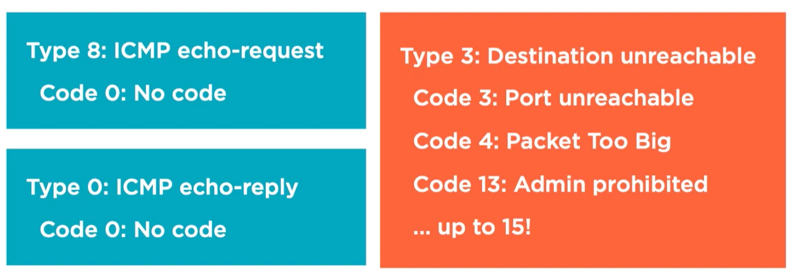
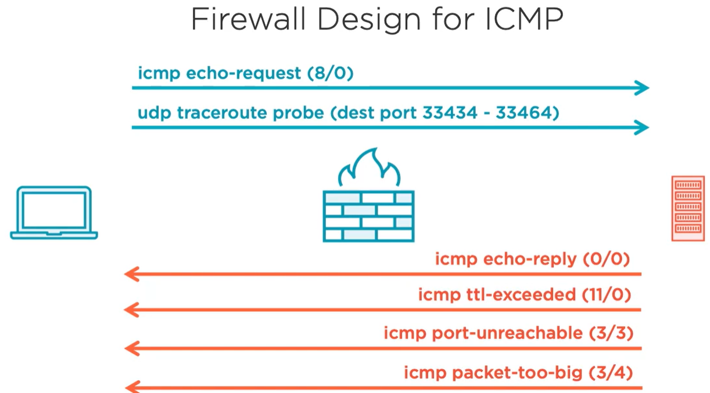

- Why is needed?
- Echo request
- Echo reply
- Como se interpreta el output de ping?
- fping?, o alguna otra manera divertida de probar?
- mpls ping?
- explain all interesting types and code and its use cases
- Que opciones se pueden poner cuando se hace ping?
- Probar ping con TCP/UDP/IP. Tambien mostrarlo para el traceroute

los codes:
- Unreachables
- TTL exceeded

Con UDP y TCP la respuesta es "Port unreachabale". Que no con TP intentaria hacer el 3-WHS? hacinedo el TCP dump.

UDP icmp usa high ports, asi que lo mas probable es que no esten usados y se regresa el mensaje de port unreachable

IP fragmentation:
- mostrar que se fragment
- mostrar que si se forza a no fragmentar entonces se pierde y ver cual es la respuesta en ICMP
- como checkar cual es el maximo mtu?
- como las aplicaciones check=an el path mtu?, mostrar captura
- alomejor un test de que toma mas tiempo cuando se fragmenta?

Mostrar un ejemplo de un host que no obtiene el "packet to big" porque esta filtrado en la red hace que se pierda la comunicacion. De otra manera mostrar cuando el packet si le llega al host y entonces este ajusta el MTU de su packete

Poner un diseno de que reglas son recomendadas para filtrar acerca de ICMP

IPv6 Neighbor discovery
- primero network solicitation (ARP request) para ver si alguien la tiene
- network advertisements (ARP reply)
- Router Solicitation, to find if therte is routers in the network
- Router announcement to give some information about the router

IPv6 Toolset

Is IPV6 ND part of ICMP?

IPv6 ND son IP packets y si hay L3 rules se pueden blockear a diferencia de ARP en IPV4. Asi que podemos habilitar lo que se usa para ND asi de esa manera funciona y para ping y traceroute usamos los puertos especificos que queremos blockear

En Ipv6 no se permite fragmentacion, asi que se necesita aceotar los paquetes de packet too big para que la palicacion ajuste. O la aplicacion empezar con un packete mas bajo hasta encontrar