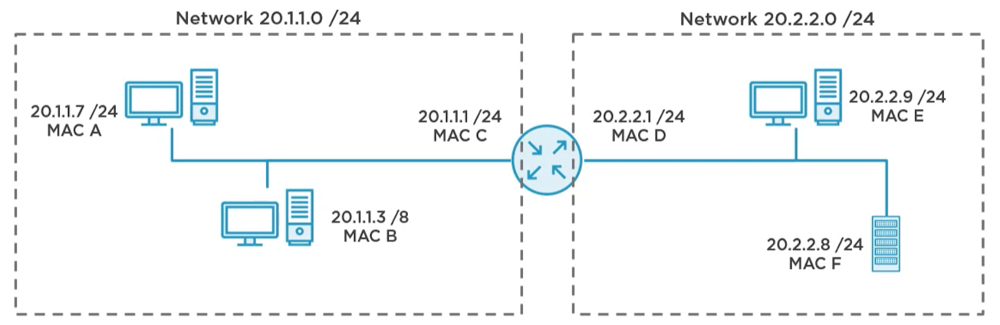

## What is ARP

## Lab creation

## ARP Messages

## ARP table

ARP on Linux:  arp -n, ip nieghbor
ARP on Cisco: show arp, show ip arp
Arp on Arista: 

clear the ARP

## ARP cache

## Static ARP

Interesting use cases for static ARP mapping

## ARP timers

Show the timers for Linux, Cisco, Arista

Agging time

## Packet camptures

Linux, Cisco, Arista. All messages

ARP fields and Ethernet headers

## ARP attacks

## Finding duplicate IPs with ARP

- Having 2 deivces with same IP responing to a ARP request. Is there a way to find the duplicate?

What means "incomplete"?

## Gratuitous ARP

To proactively say to the people that I still have the X IP tied to my Y MAC

no se espera un reply

usos
- en los FHR protocols para decir quien es el nuevo que toma el GW
- Cluster servers en el caso de que son active/stanby, si hay un problem el standby ana el GARP
- cuando se hace un clear entonces el equipo manda su GARP de la ip que el tiene y su mac

## Reverse ARP

Used by a RARP server to respond to IP/MAC mapping. What are the alternatives to this?, is DHGCP best?

## Proxy ARP

Un GW device puede responder por ARP request de ips que no estan en el mismo dominio de brodcast. En un domino recive el ARP y en otro lo pide.

Podria ser este caso para no tener que hacer el ip lookup y solo forwardear basado en la MAC?. No porque el GW responde con su propia MAC entonces lo abrira para ver el packete IP

Solo testear el siguiente caso de uso:
1. when you migrate hosts from a large network to a smal part of it. example a /8 to a /24 in same /8. host not migrated will still think the can ask the mac for an ip on the /8. A GW will be responding for this request if it has the other network connected.

ARP tables become larger

## ARP posoning

The attacker uses GARP to tell other devices (even the GW) that the attacker MAC is the one for the GW IP. This can lead to Blackholing the traffic or the attacker can inspect the traffic and then send it to the GW.

This can be controlled by having MAC based port authentication like 802.1x

